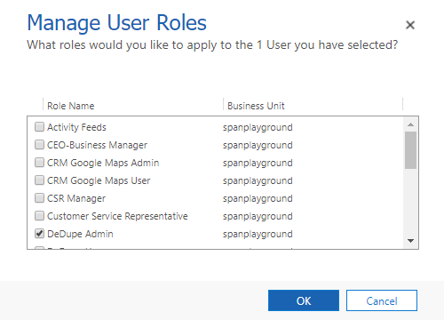
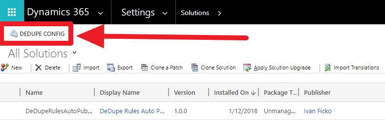
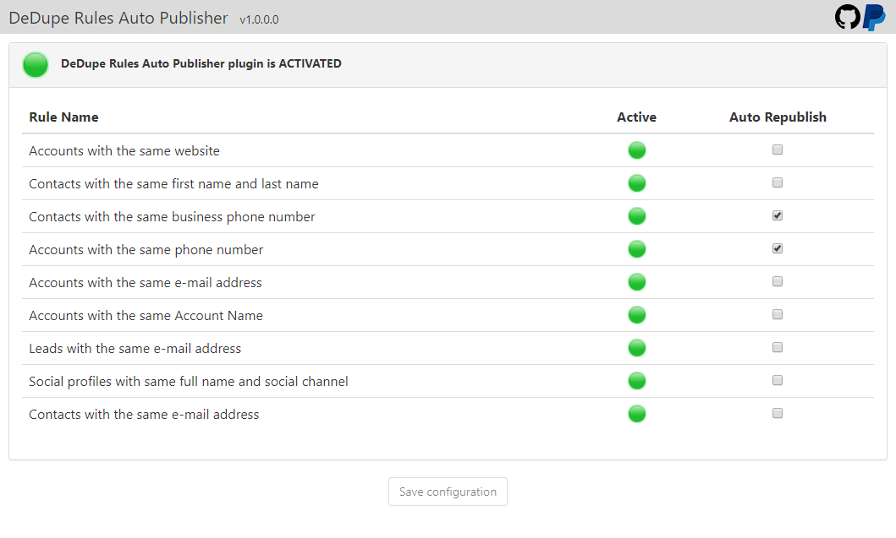
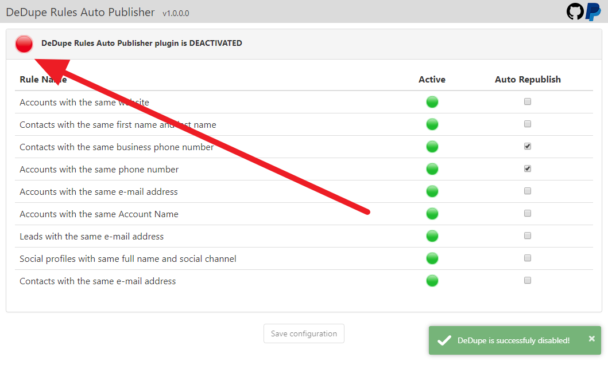

# DeDupe Rules Auto Publisher

DeDupe Rules Auto Publisher is managed Dynamics 365 v9.0 solution that will help you with keeping your duplication rules published all the time since CRM randomly unpublishes those rules while importing (Publishing) unmanaged solutions to your organization.

## Installation

1. You need to go to the [releases page](https://github.com/DynamicsNinja/DeDupe-Rules-Auto-Publisher/releases) to download the CRM solution.
2. After you downloaded your solution you need to import it on your CRM instance

## Configuration

First you need to `DeDupe Admin` role to the users that will manage DeDupe configuration.

After you imported solution you need to open DeDupe configuration page by clicking on the `DeDupe Config` button in solutions ribbon.

When you open DeDupe configuration for the first time initial configuration will be performed and it the was and success message on the bottom you are ready to go.

You can activate/deactivate DeDupe plugin by pressing the red/green dot on the top of the configuration page.

Now when everything is set up you are ready to pick which rules do you want to be auto republished by checking the checkboxes in `Auto Republish` column.
